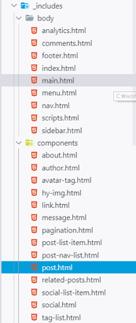
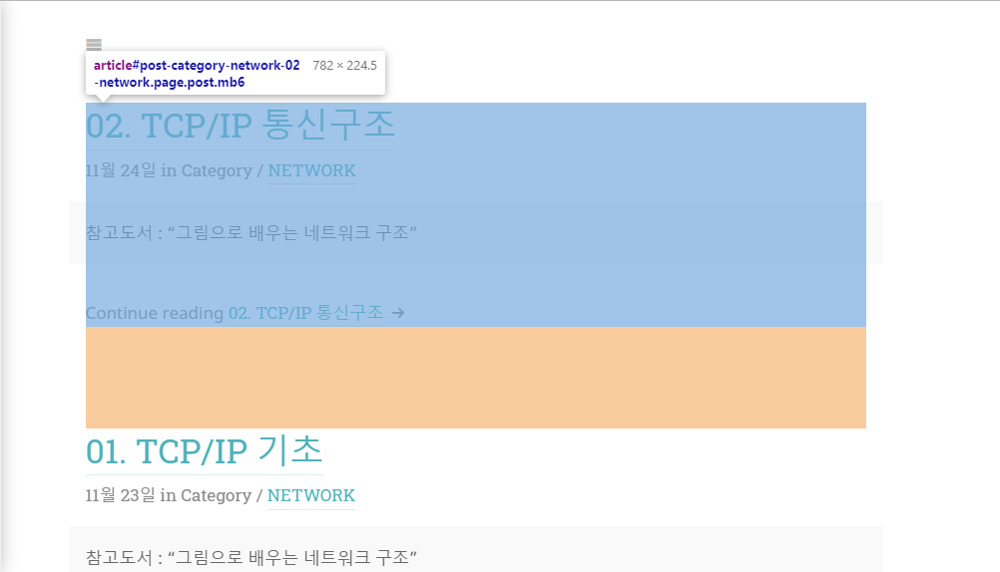

<!--more-->

## 🤷‍♀️ 왜 만들었어?

블로그를 시작하고 글을 올리면서 불편한 점이 생기고, 고치고 싶은 점이 생겼다.   
단순히 이야기나 코드 작성 외의 짜임새있는 글을 올릴 때 이상하게도 글의 구조가 한 눈에 들어오지 않는 점이 너무 불편했다.   
다른 사람들의 글은 신기하게도 술술 읽히는데 왜인지 내 포스팅만 잘 안읽히는 것 같고 중구난방으로 흩어져 있는 느낌이 계속 들었다.   
그래서 ~~네비게이션 바~~가 필요하다고 느꼈고, 이게 있으면 글을 쓴 후에도 구조를 보면서 수정/보완할 수 있을 것이라는 기대를 했다.   
하지만 단순히 테마 개념으로 시작했기 때문에 정확하게 어떻게 페이지가 만들어 지는지 알 지 못해서 시도조차 할 수 없었다.   
이번에 [네트워크](https://mkl0819.github.io/network) 정리를 하면서 이 불편함이 더 크게 느껴졌고 너무 **짜증**이 나서 그냥 무턱대고 만들어보기로 했다.   
우선, jekyll 블로그를 하는 사람으로서 ruby를 모른다는 사실이 굉장히 부끄럽지만... 현재 내가 할 수 있는 선에서 고쳐보고자 노력했다.   

## 🤷‍♀️ 어떻게 했어?

### 0. 어디를 어떻게 만져야할까...

   
대충 구조를 살펴보니 전체적인 화면은 `main.html`에서 만들어지고,   
우리가 작성한 포스트는 `post.html`에서 구성이 된다.
     
     
    
``` html
{_% assign post          = include.post          %}
{_% assign no_link_title = include.no_link_title %}
{_% assign no_excerpt    = include.no_excerpt    %}
{_% assign hide_image    = include.hide_image    %}

<article id="post{_{ post.id | replace:'/','-' }}" class="page post mb6" role="article">
  <header>
    <h1 class="post-title">
      {_% unless no_link_title %}<a href="{_{ post.url | relative_url }}" class="flip-title">{_% endunless %}
        {_{ post.title }}
      {_% unless no_link_title %}</a>{_% endunless %}
    </h1>

    <p class="post-date heading">
      {_% assign post_format = site.data.strings.date_formats.post | default:"%d %b %Y" %}
      <time datetime="{_{ post.date | date_to_xmlschema }}">{_{ post.date | date:post_format }}</time>
      {_% assign category_start     = site.data.strings.category_start     | default:"in " %}
      {_% assign tag_start          = site.data.strings.tag_start          | default:"on " %}
      {_% assign category_separator = site.data.strings.category_separator | default:" / " %}
      {_% assign tag_separator      = site.data.strings.tag_separator      | default:", "  %}
      {_% include components/tag-list.html tags=post.categories meta=site.featured_categories start_with=category_start separator=category_separator %}
      {_% include components/tag-list.html tags=post.tags meta=site.featured_tags start_with=tag_start separator=tag_separator %}
    </p>

    {_% assign alt = false %}
    {_% unless hide_image %}{_% if post.image %}
      <div class="img lead sixteen-nine">
        {_% include components/hy-img.html img=post.image alt=post.title %}
      </div>
      {_% assign alt = '' %}
    {_% endif %}{_% endunless %}

    {_% include components/message.html text=post.description hide=page.hide_description alt=alt %}
  </header>

  {_% if no_excerpt %}
    {_{ post.content }}          // 우리가 작성한 markdown 파일
  {_% else %}
  {_{ post.excerpt }}
  {_% capture post_title %}<a class="heading flip-title" href="{_{ post.url | relative_url }}">{_{ post.title }}</a>{_% endcapture %}
  {_% assign text = site.data.strings.continue_reading | default:"Continue reading <!--post_title-->" %}
  <footer>
    <p class="read-more">
      {_{ text | replace:"<!--post_title-->", post_title }}
    </p>
  </footer>
  {_% endif %}
</article>
```
위의 코드는 `post.html`이다.   


 

`{_% if no_excerpt %}` 코드를 기준으로 `<article>` 태그는 **포스팅 하나의 상세 페이지**를 나타내거나 **포스팅 목록의 미리보기** 부분을 나타낸다.

**포스팅 하나의 상세 페이지**는 `{_% if no_excerpt %}`일 경우이고 해당 `markdown` 파일은 변환기를 거쳐서 `{_{post.content}}` 에 들어가는 것으로 보인다.


이를 통해 알아낸 것은   
1. post.html 에서 작업해야 함
2. `{_% if no_excerpt %}` 일 때만 나오게 해야 함
3. 만만치 않을 것임

### 1. 실패쓰1

```javascript
function upgradeHeading(h) {
    const df = importTemplate("_permalink-template");
  const a = df.querySelector(".permalink");
  console.log(h.id)
  requestAnimationFrame(() => ((a.href = `#${h.id}`), h.appendChild(df)));
}
```
`push-state.js` 파일에 보면 `upgradeHeading` 함수가 변환된 md 파일의 `header` 태그에 링크기능을 추가해준다.   
나도 이 파일을 활용해서 해보려고 했지만 나의 너무나도 작고 소중한 역량때문에 성공하지 못했다.   

### 2. 실패쓰2

두 번째 생각한 것은   
`post.html` 파일처럼 `post-nav-list.html` 파일을 만들어서   

```javascript
  {_% if no_excerpt %}
    {_{ post.content }}
    {_%  include.post-nav-list.html post=post.content %}          
  {_% else %}
```
**post.html**

```javascript
{_% assign post = include.post %}

<div class="post-nav-list">
    {_{post.content}}
</div>
```
**post-nav-list.html**

이렇게 `post-nav-list.html` 파일에 md 파일 내용을 넘기고 **css**를 이용해서 만들었다.   
결과는 **성공**처럼 보였지만 `display: none;`으로 눈속임을 했을 뿐 정확히 똑같은 내용을 중복해서 가지고 있는 결과였다.   
게다가 **css** 적용도 잘 되지 않았다... ㅠㅠ 힘들어 (해당 페이지에서 새로고침해야 정상작동)  

### 3. 성공쓰 >_<

> 지긋지긋한 오류놈들
> 1. post를 구성하고 있는 article 태그 내부에 nav를 생성하니까 브라우저 기준이 아닌 article 태그를 기준으로 position이 설정되었음
> 2. 해당 페이지에서 새로고침을 해야 제대로 된 css 적용이 되었음
> 3. 현재 필요한 h1~h6 태그 외에도 전체 데이터를 가지고 있음

아무리 생각해도 비효율적이고 무식한 방법이라는 생각이 들었고   
`post.html`에서 `script` 태그를 통해 해결하고자 했다.   

```javascript
<script>
    var pushStateEl = document.getElementsByTagName('hy-push-state')[0];
    var postContent = document.getElementsByTagName('article')[0];

    var postNavList = document.createElement("div");
    postNavList.classList.add("post-nav-list");
    
    var headers = ["H1", "H2", "H3", "H4", "H5", "H6"];

    for(var i=0, size=postContent.childElementCount; i<size; i++){
        if(0<=headers.indexOf(postContent.children[i].tagName)){
            var link = document.createElement('a');
            link.href = "#" + postContent.children[i].id;
            link.append(postContent.children[i].cloneNode(true));
            postNavList.append(link);
        }else if(postContent.children[i].tagName=="SCRIPT"){
            break;
        }
    }
    pushStateEl.appendChild(postNavList);
</script>
```
>**pushStateEl**   
>- `article`의 부모인 `main` 태그와 동급에 위치해야된다고 생각했기 때문에 이들의 부모인 `hy-push-state`태그를 불러옴 
>
>**postContent**     
>- post 내용을 구성하는 `article` 태그      
>
>**postNavList**   
> - 내가 만들고자 하는 네비게이션 바!!!!!!!   
> - class 적용으로 style 부분은 해결 >_<    
>
>**headers**
> - 헤더 태그인지 구분하기 위한 헤더 배열    

**postContent**의 자식 요소들이 **headers**태그인지 검사하면서 만약 맞다면 **a** 태크를 생성하고 해당 요소의 id로 갈 수 있도록 **href** 설정을 한 후
**postNavList**에 추가한다.   
모든 탐색이 끝나면 **css**가 잘 적용될 수 있도록 **pushStateEl**에 **postNavList**를 추가한다.   

이외에 약간의 css 조정을 하면서 작은화면일 때는 안나오게 하는 등의 작업을 했다.  

## 😝 워뗘?????

후... 조금 힘들었다. 그리고 기뻤다!   
사실 이 방법은 **야매**다. 정확하지 않고 매우 부끄러운 방법이라는 것을 나도 알긴 알지만   
현재 나의 실력과 시간과 노력을 종합해봤을때 최선의 선택이었고 나름 괜찮은 결과를 가져왔다고 생각한다.   
나중에 이 코드들을 보고 굉장히 이불을 찰 수도 있겠징...   
그래도 조금 쪽팔린 방법이라도 내가 필요한 것을 만들어냈다는 것에 의미를 가지기로 했다.   
그리고 그냥 둘 수도 있었지만 나름 고생했으니까 기록을 남겨보기로 했당!   
미래의 내가 더 좋은 코드로 수정해주겠지! 그럼 오늘은 여기까지!! 